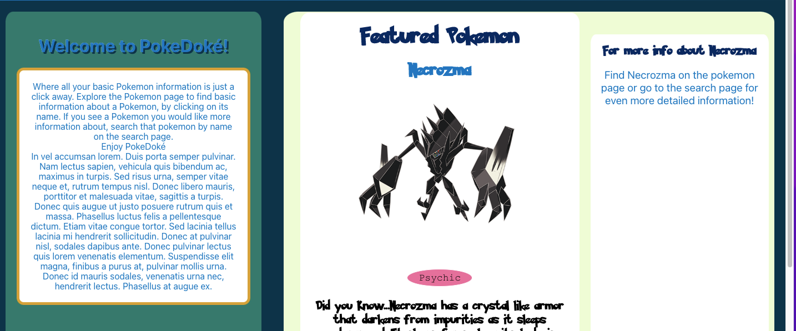
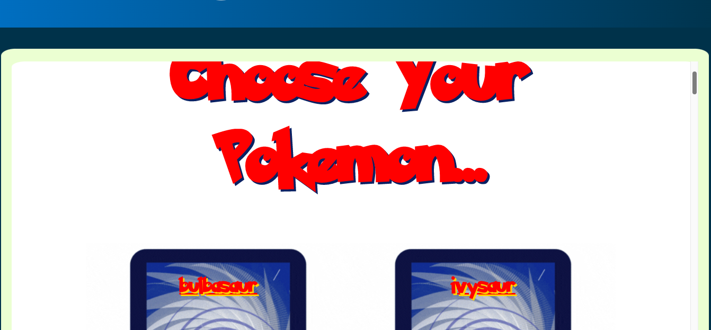
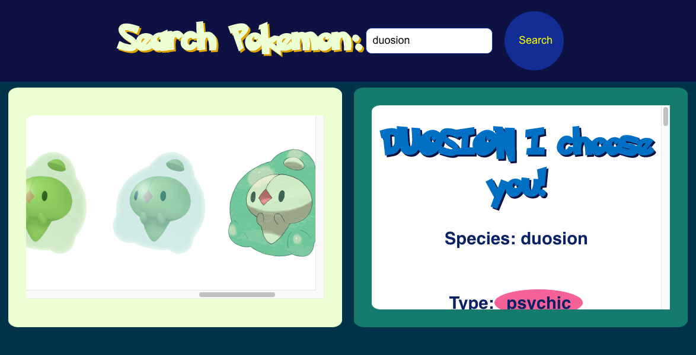

# PokéDoké
 I created this project to showcase my skills using API's and React. I designed it with a bright colors scheme chosen from the Pokemon Go logo. I wanted to keep the fun spirit of Pokemon alive in my design aesthetics.

# Screen Shots 

My custom logo made with a pokemon font and a graphic created on Canva

This page welcomes the user and randomizes a featured pokemon each time.

The pokemon page shows a list of all the pokemon recieved from the api, styled as the backs of Pokemon cards. 

Once you click on a name displayed on the back of the pokemon card, it will then show a picture and simple info about that pokemon styled as a pokemon card.

If you want even more detailed information you would go to the search page and look up that Pokemon by name.

# Technology Used
- Built with React
- logo and pokemon cards (front and back)built with Canva
- [PokeApi](https://pokeapi.co/) for info
-[Youtube](https://www.youtube.com/)for research and tutorials

# Code Example
`const searchAllPokemon = () => {
    axios.get(`https://pokeapi.co/api/v2/pokemon/${pokeName}`).then(
      (response) => {
        setPokemon({
          name: pokeName,
          species: response.data.species.name,
          img: response.data.sprites.front_default,
          hp: response.data.stats[0].base_stat,
          attack: response.data.stats[1].base_stat,
          defense: response.data.stats[2].base_stat,
          types: response.data.types,
          id: response.data.id,
          abilities: response.data.abilities,
          moves: response.data.moves,
          game_indices: response.data.game_indices
        })
        setPokemonFound(true)
      }
    ).catch(err => {
      console.log('nothing found')
      setPokemonFound(false)

    })
  };`
This colde calls the PokemonApi and assigns key values to each pokemon searched.

# API Used
For this project I used the [Pokeapi](https://pokeapi.co/) to get all of the different information that can be displayed about each Pokemon. To visit this api click the word "Pokeapi" above.

# How to use?
Simply click [Here](https://ashleyoliver218.github.io/pokedoke/) to utilize the application.
If you wanted to use the project as a starting point for your own project you would have to create a react application in your terminal by typing: npx create-react-app *file name*
then when that is finished: npm install axios
and then git clone the files from my repository. To run a live server to see the application visually: npm start

# Up-Coming Features
- Responsive design optimized for mobile use
- Pokemon listed alphabetically on Pokemon link
- Pokemon can be searched using upper and lowercase letters
- Pokemon can be searched by type

# Credits
Kasper for all your help
Web Dev Simplified 
Pedro Tech [How to Deploy A React App To GitHub Pages(Simple)](https://www.youtube.com/watch?v=Q9n2mLqXFpU)

[Building a Pokemon Web App - Pokemon API ReactJS](https://www.youtube.com/watch?v=QFPSIT3ZR7Q)

[Build A Pokémon Application With React - Tutorial](https://www.youtube.com/watch?v=o3ZUc7zH8BE&t=180s)